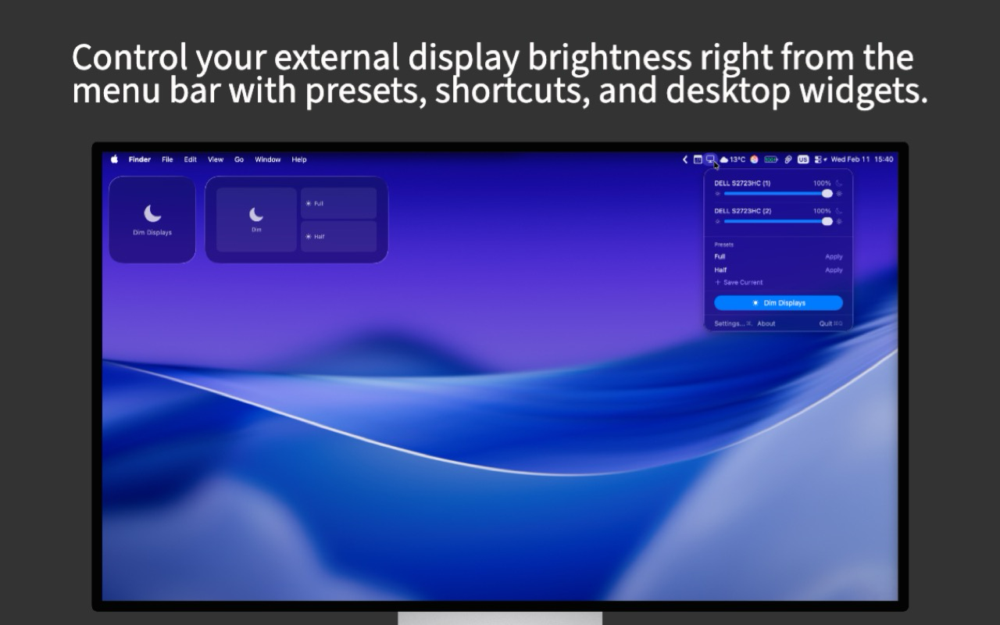

# Dimmerly

A lightweight macOS menu bar utility for controlling external display brightness — with presets, keyboard shortcuts, and desktop widgets.




## Features

- **Per-Display Brightness Control** — Individual sliders for each connected external display
- **Color Temperature (Warmth)** — Per-display warmth adjustment from neutral to warm (~1900K)
- **Auto Color Temperature** — Automatic warmth adjustment based on time of day using sunrise/sunset data
- **Contrast Control** — Per-display contrast via symmetric S-curve gamma adjustment
- **DDC/CI Hardware Control** — Direct hardware brightness, contrast, and volume control via DDC/CI protocol (direct distribution only)
- **Input Source Switching** — Switch monitor inputs (HDMI, DisplayPort, USB-C) from the menu bar
- **Audio Mute Toggle** — Mute/unmute monitors with built-in speakers via DDC
- **Brightness Presets** — Save, name, and instantly apply display configurations (brightness, warmth, contrast)
- **Smooth Preset Transitions** — Animated ~300ms interpolation when switching presets (respects Reduce Motion)
- **Global Keyboard Shortcuts** — Dim displays or apply presets from any app
- **Desktop Widgets** — Small and medium widgets for quick access
- **Control Center Integration** — Quick toggle from Control Center (macOS 26+)
- **Shortcuts App Support** — Automate display control with Shortcuts workflows (6 actions: brightness, warmth, contrast, sleep, toggle dim, apply preset)
- **Scheduled Presets** — Automatically apply presets at specific times, sunrise, or sunset
- **Auto-Dim** — Automatically dim displays after a configurable idle period
- **Fade Transition** — Smooth fade-to-black animation option
- **Ignore Mouse Movement** — Only wake screens on keyboard or click
- **Display Blanking** — Dim individual displays independently
- **Accessibility** — Full VoiceOver support, respects Reduce Motion, semantic accessibility labels on all controls
- **Menu Bar Icon Styles** — Choose from 5 icon styles
- **Launch at Login** — Start automatically when you log in
- **Light & Dark Mode** — Full support for both appearances
- **Localized** — Available in 11 languages (English, German, Spanish, French, Italian, Japanese, Korean, Dutch, Portuguese (BR), Serbian, Chinese (Simplified))
- **Privacy-Focused** — No data collection, no app-managed network requests, no tracking

## Requirements

- macOS 15.0 (Sequoia) or later
- External display with DDC/CI brightness support (USB-C/DisplayPort recommended; HDMI via multi-transport fallback)
- Optional: Accessibility permissions for global keyboard shortcuts
- Optional: Location permission for sunrise/sunset schedules

## Installation

### Mac App Store

Dimmerly is available on the [Mac App Store](https://apps.apple.com/app/dimmerly). The App Store version uses screen blanking to comply with sandbox requirements.

### From Source

1. Clone this repository:
   ```bash
   git clone https://github.com/olujicz/Dimmerly.git
   cd Dimmerly
   ```

2. Open the project in Xcode:
   ```bash
   open Dimmerly.xcodeproj
   ```

3. Build and run:
   - Select the **Dimmerly** scheme
   - Press **⌘R**
   - The app will appear in your menu bar

## Usage

### Menu Bar Panel

Click the Dimmerly icon in your menu bar to open the panel:

- Adjust brightness per display with sliders
- Expand "Display Adjustments" for warmth, contrast, and auto color temperature
- Toggle Auto Warmth to automatically adjust color temperature throughout the day
- Dim individual displays with the moon toggle
- Apply saved presets with a click, or right-click to save current settings to a preset
- Save current display settings as a new preset
- Dim all displays with the main button

### Keyboard Shortcuts

| Action | Default Shortcut | Customizable |
|--------|------------------|--------------|
| Dim Displays | ⌘⌥⇧D | Yes |
| Apply Preset | — | Yes (per preset) |
| Open Settings | ⌘, | No (in menu) |
| Quit | ⌘Q | No (in menu) |

Global shortcuts require Accessibility permission (System Settings > Privacy & Security > Accessibility).

### Presets

Dimmerly includes three default presets:

- **Full** — 100% brightness, neutral warmth and contrast
- **Evening** — 70% brightness, moderate warmth
- **Night** — 30% brightness, high warmth

You can save up to 10 custom presets and assign keyboard shortcuts to each. Right-click a preset to update it with your current display settings.

### Widgets

- **Small Widget** — Quick dim button
- **Medium Widget** — Dim button + up to 3 preset buttons

Add widgets by right-clicking the desktop > Edit Widgets > Dimmerly.

### Scheduled Presets

Automatically apply presets at specific times of day:

- **Fixed Time** — Trigger at an exact time (e.g., 8:00 PM)
- **Sunrise/Sunset** — Trigger relative to sunrise or sunset with an optional offset (e.g., 30 min before sunset)

Schedules reference your existing presets, so editing a preset automatically updates what the schedule applies. Sunrise and sunset triggers require a location — use "Use Current Location" or enter coordinates manually in Settings.

### Settings

Access via the menu bar panel (Settings... or ⌘,). All settings are presented in a single grouped form:

- **General** — Launch at login, menu bar icon style
- **Color Temperature** — Day and night temperature targets, transition duration
- **Dimming** — Display sleep vs dim-only mode, fade transition, wake input options, ignore mouse movement
- **Idle Timer** — Auto-dim after inactivity with configurable timeout (1–60 minutes)
- **Schedule** — Enable scheduled presets, set location (automatic or manual coordinates), manage schedules
- **Keyboard Shortcut** — Global keyboard shortcut for dimming, accessibility permission status
- **Presets** — Rename, delete, assign per-preset shortcuts, restore defaults
- **About** — App information, source code link

## Building from Source

### Prerequisites

- Xcode 16.0 or later
- macOS 15.0 SDK or later
- Swift 6.0 or later
- Optional: [just](https://github.com/casey/just) command runner (run `just setup` to configure pre-commit hooks)
- Optional: [SwiftLint](https://github.com/realm/SwiftLint) and [SwiftFormat](https://github.com/nicklockwood/SwiftFormat) for linting

### Build Configurations

| Configuration | Scheme | Description |
|---------------|--------|-------------|
| Debug | Dimmerly | Development build with `pmset` display sleep |
| Release | Dimmerly | Distribution build with `pmset` display sleep |
| Debug-AppStore | Dimmerly App Store | Development build with gamma-based screen blanking |
| Release-AppStore | Dimmerly App Store | App Store submission build |

### Justfile Commands

A [Justfile](Justfile) provides convenient shortcuts for common tasks:

```bash
just setup          # Configure pre-commit hooks (SwiftFormat, SwiftLint, secrets detection)
just build          # Build debug
just build-release  # Build release
just test           # Run tests
just run            # Build and run
just lint           # Lint Swift sources (SwiftLint)
just lint-fix       # Auto-fix linting issues
just format         # Format Swift sources (SwiftFormat)
just format-check   # Check formatting without changes
just clean          # Clean build artifacts
```

### Continuous Integration

GitHub Actions runs on every push and pull request to `main`:

- **Lint** — SwiftLint with `--strict` mode
- **Test** — Full test suite on macOS 15 with Xcode 16.4

### Running Tests

```bash
just test
```

Or with xcodebuild directly:

```bash
xcodebuild test -scheme Dimmerly -destination 'platform=macOS'
```

Or use Xcode's Test Navigator (⌘6).

## Technical Details

### Architecture

Built with Swift 6 and the Observation framework (`@Observable`). All state is managed through observable managers injected via SwiftUI's environment. No third-party dependencies — pure Apple frameworks only.

### Standard Build (Direct Distribution)

Uses `pmset displaysleepnow` to sleep displays. Includes an optional "Prevent Screen Lock" mode that blanks screens via gamma tables without triggering a session lock.

### App Store Build (Sandboxed)

Uses gamma table dimming (`CGSetDisplayTransferByFormula`) to black out displays. Works over fullscreen apps and dims the cursor. Gamma is restored instantly on any user input via `CGDisplayRestoreColorSyncSettings()`. If the app exits unexpectedly, macOS automatically restores gamma to normal.

## Privacy

- **No Data Collection** — Dimmerly does not collect, store, or transmit any personal data
- **No App-Managed Network Requests** — The app does not send data to developer-owned servers, analytics, or tracking services
- **No Tracking** — No analytics, crash reporting, or usage statistics
- **Local Only** — All settings are stored locally using UserDefaults
- **Open Source** — The entire codebase is available for inspection

Optional system location services may use Apple-provided location infrastructure when you choose "Use Current Location" for sunrise/sunset schedules.

See the full [Privacy Policy](https://olujicz.github.io/Dimmerly/privacy-policy.html).

## Open Source + App Store

Dimmerly is fully open source under the MIT License. You can build and run it from source for free.

The [Mac App Store listing](https://apps.apple.com/app/dimmerly) is a convenient way to install the app and support ongoing development.

If you find Dimmerly useful, consider:
- Purchasing from the App Store to support development
- Starring the repository on GitHub
- Contributing code, bug reports, or feature ideas

## Contributing

Contributions are welcome! Please feel free to submit issues, feature requests, or pull requests.

1. Fork the repository
2. Create a feature branch: `git checkout -b feature-name`
3. Run `just setup` to configure pre-commit hooks
4. Make your changes and add tests
5. Run `just lint` and `just test` to ensure code quality and all tests pass
6. Submit a Pull Request

Please review the [Code of Conduct](CODE_OF_CONDUCT.md) before participating. See the [Security Policy](SECURITY.md) for reporting vulnerabilities.

## Troubleshooting

### Displays Don't Sleep

1. Ensure `/usr/bin/pmset` exists on your system (included with macOS)
2. Check System Settings > Lock Screen and ensure display sleep is not disabled
3. App Store version blanks screens rather than sleeping displays — move your mouse or press any key to dismiss

### Keyboard Shortcut Doesn't Work

1. Check that Accessibility permission is granted in System Settings > Privacy & Security > Accessibility
2. Restart Dimmerly after granting permissions
3. Try a different shortcut to avoid conflicts with other apps

### Brightness Slider Has No Effect

1. Verify your external display supports DDC/CI brightness control
2. Some USB-C/DisplayPort hubs may not pass through DDC commands
3. Try connecting the display directly to your Mac
4. On Apple Silicon (M1–M4), Dimmerly tries three I2C transport paths automatically — if one fails, the next is attempted
5. Built-in HDMI on M1/entry M2 Macs does not support DDC; use USB-C or DisplayPort instead

## License

This project is licensed under the MIT License — see the [LICENSE](LICENSE) file for details.

## Support

If you encounter issues:

1. Check the [Troubleshooting](#troubleshooting) section
2. Search existing [GitHub Issues](https://github.com/olujicz/Dimmerly/issues)
3. Create a new issue with your macOS version, Dimmerly version, and steps to reproduce
