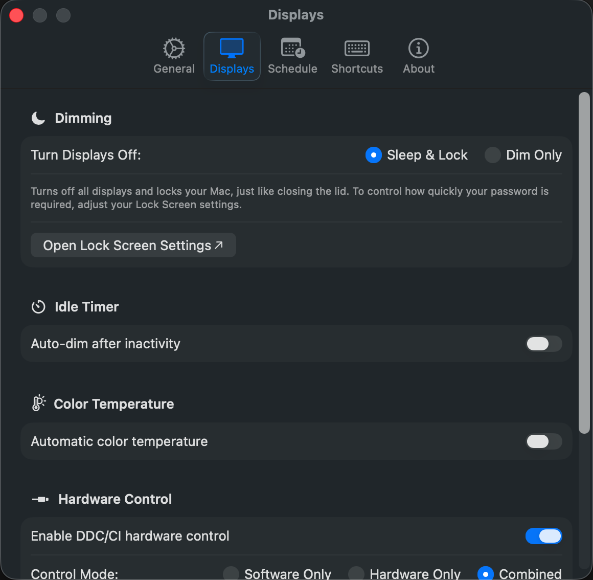

# Dimmerly

Dimmerly is a native macOS menu bar app for display brightness, warmth,
contrast, presets, schedules, and display sleep.

It is mainly built for external-monitor setups where the useful controls are
either buried in the monitor OSD or split across System Settings. On supported
external displays, Dimmerly can use DDC/CI for hardware brightness and monitor
controls. When DDC/CI is not available, it falls back to software dimming.


## Features

- Per-display brightness, warmth, contrast, and blanking controls
- Built-in display support where macOS exposes the needed controls
- Presets for saving and restoring complete display setups
- Global keyboard shortcuts for dimming and presets
- Schedules based on a fixed time, sunrise, or sunset
- Desktop widgets and Shortcuts actions
- Optional automatic color temperature changes
- Optional auto-dim after inactivity
- Direct-download build: display sleep through macOS tools
- Direct-download build: DDC/CI hardware brightness, contrast, volume, mute, and input switching
- App Store build: sandbox-compatible software dimming and screen blanking
- VoiceOver labels and Reduce Motion support
- Local settings only; no analytics, tracking, or app-managed network requests

## Requirements

- macOS 15 Sequoia or later
- Optional Accessibility permission for global shortcuts
- Optional Location permission for sunrise and sunset schedules
- Optional DDC/CI-capable external monitor for hardware controls

## Install

### Direct Download

Download the latest signed and notarized DMG from
[GitHub Releases](https://github.com/olujicz/Dimmerly/releases/latest).

This build has the full feature set, including display sleep, DDC/CI hardware
control, monitor input switching, and hardware volume controls where the display
and connection support them.

### App Store Build

The repository also includes a sandboxed App Store configuration. Because that
build runs inside Apple's sandbox, it uses software dimming and screen blanking
instead of DDC/CI or system display sleep.

### Build From Source

See [BUILDING.md](BUILDING.md) for Xcode requirements, build configurations,
test commands, and architecture notes.

## Build Differences

| Capability | Direct download | App Store build |
| --- | --- | --- |
| Per-display brightness, warmth, and contrast | Yes | Yes |
| Presets, schedules, widgets, Shortcuts | Yes | Yes |
| Display sleep using macOS system tools | Yes | No |
| DDC/CI hardware monitor control | Yes | No |
| Monitor input switching | Yes | No |
| Hardware monitor volume and mute | Yes | No |
| App Sandbox | No | Yes |

Use the direct-download build if you want the hardware monitor controls. Use
the sandboxed build when App Store distribution or sandboxing matters more.

## Screenshots



## Usage

### Menu Bar Controls

Open Dimmerly from the menu bar to adjust each display. The main slider controls
brightness. Expand a display row for warmth, contrast, and, when available,
DDC/CI controls such as volume or input source.

If a display shows the hardware indicator, Dimmerly is talking to it through
DDC/CI. Otherwise the app uses software dimming for that display.

### Presets And Schedules

Presets save the current display setup: brightness, warmth, and contrast for
each display. They can be applied from the menu bar, widgets, Shortcuts,
schedules, or per-preset keyboard shortcuts.

Schedules can run at a fixed time, at sunrise, at sunset, or with an offset
from sunrise or sunset. Sunrise and sunset schedules can use your current
location or manually entered coordinates.

### Dimming And Wake Behavior

The direct-download build can put displays to sleep. Dim-only mode keeps the
session visible but darkened, which is useful when you want quick wake behavior
without display sleep.

Wake behavior can be configured for:

- keyboard, click, scroll, or mouse movement
- keyboard, click, or scroll when mouse movement is ignored
- Escape only for stricter dismissal

Animated transitions respect the macOS Reduce Motion setting.

### Automation

Dimmerly includes Shortcuts actions for setting brightness, warmth, and contrast,
sleeping displays, toggling dimming, and applying presets.

It also includes small and medium desktop widgets for quick dimming and preset
access.

## Privacy

Dimmerly does not collect analytics, usage data, crash reports, or personal data.

Settings are stored locally with UserDefaults. If you use current location for
sunrise and sunset schedules, macOS Location Services provides the coordinate
used for the calculation. Dimmerly does not send that coordinate to a
developer-owned service.

Read the full [Privacy Policy](https://olujicz.github.io/Dimmerly/privacy-policy.html).

## Troubleshooting

### Brightness Does Not Change The Monitor Backlight

If a display does not show the hardware indicator, Dimmerly is using software
dimming for that display. Software dimming changes perceived brightness, not the
monitor backlight.

Common reasons DDC/CI is unavailable:

- the monitor does not support DDC/CI
- DDC/CI is disabled in the monitor's on-screen menu
- a USB-C hub, dock, KVM, HDMI adapter, or DisplayLink adapter blocks DDC commands
- the display is connected through built-in HDMI on some Apple Silicon Macs

Try connecting the monitor directly over USB-C or DisplayPort and check the
monitor's settings for DDC/CI support.

### Keyboard Shortcuts Do Not Work

Global shortcuts require Accessibility permission:

```text
System Settings -> Privacy & Security -> Accessibility
```

After granting permission, restart Dimmerly. If the shortcut still does not
work, choose a shortcut that is not already reserved by macOS or another app.

### Displays Wake Too Easily

Open Settings and adjust the dimming wake behavior. Enable "Ignore mouse
movement" if small pointer movement wakes the displays, or enable Escape-only
dismissal for stricter control.

## Development

Dimmerly is a Swift 6 macOS project with no third-party runtime dependencies.

Useful commands:

```bash
just setup
just format-check
just lint
just test
just build-release
```

Project documentation:

- [BUILDING.md](BUILDING.md) - local build, test, and architecture notes
- [docs/RELEASE.md](docs/RELEASE.md) - release process for signed and notarized builds
- [docs/REPOSITORY_SETTINGS.md](docs/REPOSITORY_SETTINGS.md) - required GitHub repository settings
- [SECURITY.md](SECURITY.md) - supported versions and vulnerability reporting

## Contributing

Bug reports, focused fixes, and well-scoped feature proposals are welcome.

Before opening a pull request:

1. Run `just setup` once to enable the local pre-commit hooks.
2. Keep changes focused.
3. Add or update tests for behavior changes.
4. Run `just format-check`, `just lint`, and `just test`.
5. Update `CHANGELOG.md` when the change affects users.

Read [CONTRIBUTING.md](CONTRIBUTING.md) and [CODE_OF_CONDUCT.md](CODE_OF_CONDUCT.md)
before participating.

Security vulnerabilities should not be reported in public issues. Follow
[SECURITY.md](SECURITY.md).

## License

Dimmerly is released under the MIT License. See [LICENSE](LICENSE).
